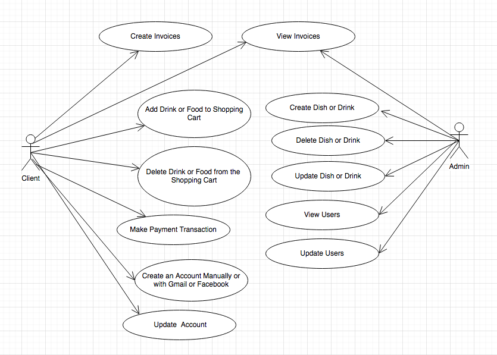
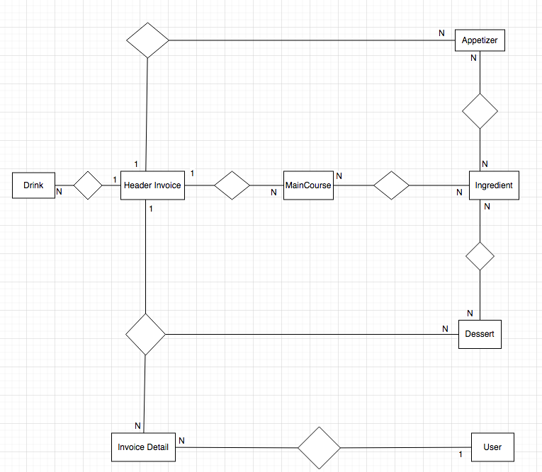
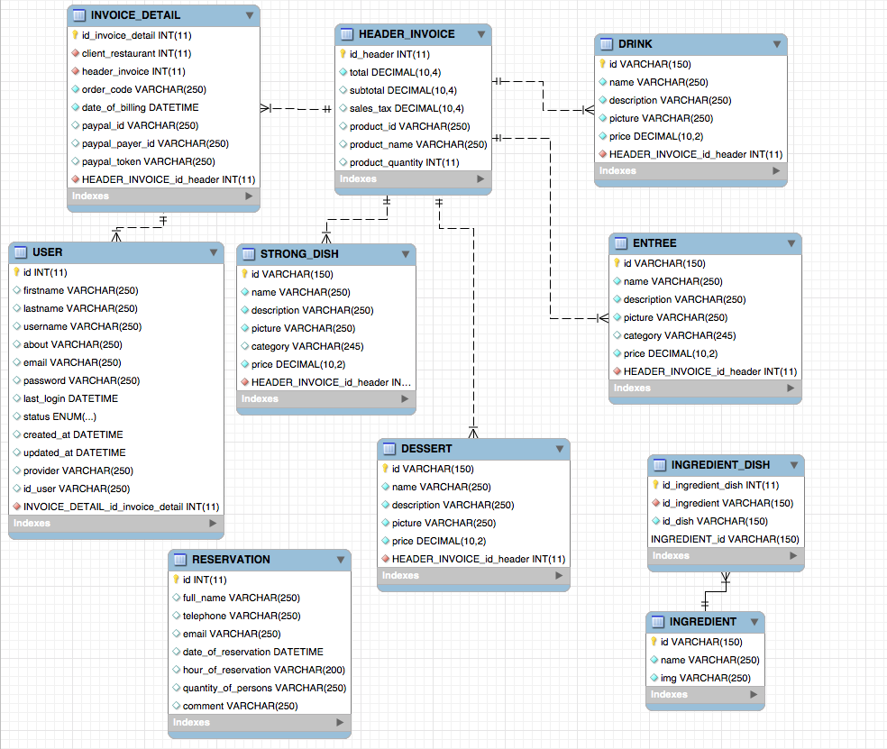

# server-nodejs-restaurant

This project require another project as Front-End [React Restaurant Admin](https://github.com/LeoCR/react-restaurant-admin-crud/).

### Use Case Diagram

### Entity Relationship Model

### Entity Relationship Diagram 

Run: `npm run local`
Open [https://localhost:49658](https://localhost:49658) to view it in the browser
